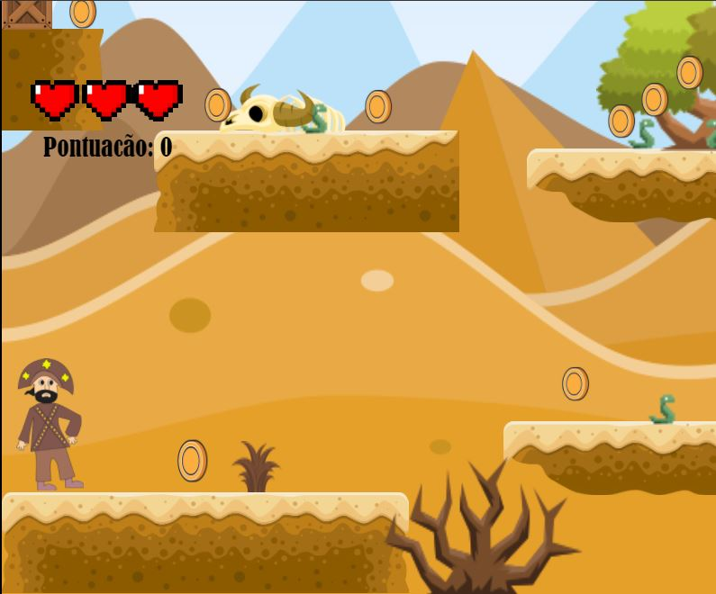
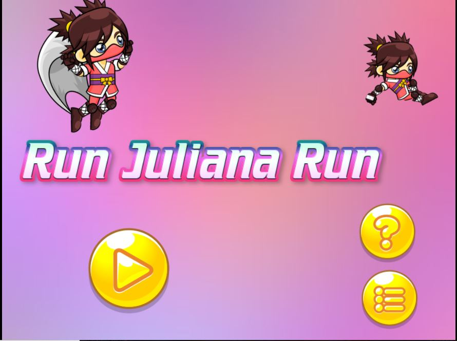
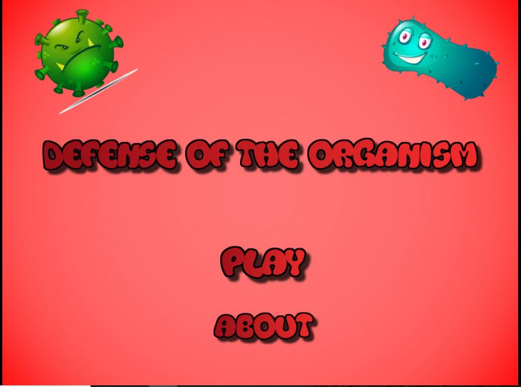
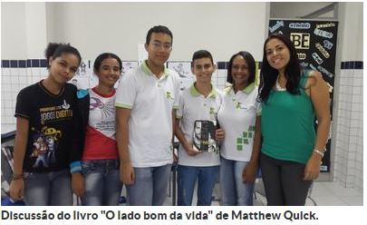
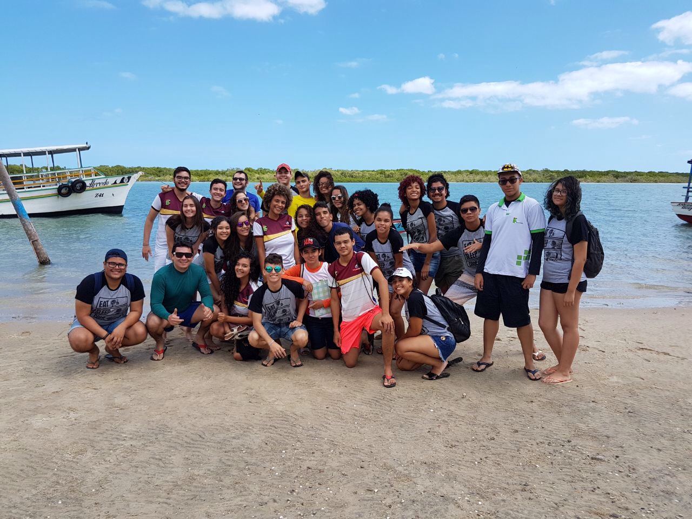

# Quem sou eu:

Matheus Augusto.

Aluno do curso técnico integrado ao ensino médio em Programação de Jogos Digitais pelo Instituto Federal de Educação, Ciência e Tecnologia(IFRN)

Essa página foi criada como requisito avaliativo na disciplina de Motores de Jogos II ministrada pelo Professor: Ms. Marcelo de Barros Barbosa.

Contato:  
 Email Pessoal: mathaugustt@icloud.com  
 Email Acadêmico: matheus.soares@academico.ifrn.edu.br  
 [Currículo Lattes](http://lattes.cnpq.br/8754198449610994)  
 
# Portfólio

## Games:

**NORDESTE ADVENTURE**  

~~Primeiro Joguinho, né galera?~~  

O Lampião precisa escapar de alguns obstáculos em alguns cenários do nordeste, afim de chegar ao Padre Cícero. O Jogo foi desenvolvido junto com a colega Bruna Noronha como requisito avaliativo do 1º Bimestre para a disciplina de Oficina de Jogos Digitais ministrada pelo Professor: Ms. Marcelo Barbosa.  
[Site da Bruna](brunitxia.github.io)

* * *

**RUN JULIANA RUN**  

**ESSE FOI UM SUCESSO! <3**  

A Juliana é uma ninja que carrega a missão de pegar todas as letras perdidas afim de desvendar uma mensagem e trazer felicidade para o Natal e Halloween. O Jogo foi desenvolvido com o colega Lucas Revorêdo como requisito avaliativo do 2º Bimestre para a disciplina de Oficina de Jogos Digitais ministrada pelo Professor: Ms. Marcelo Barbosa.  
[Site do Lucas](revoredoo.github.io)

* * *

**DEFENSE OF THE ORGANISM**  

_Tentando, ainda em fase de testes!_  

Jogo em estilo Tower Defense desenvolvido para servir como bases para o Relatório de Projeto Integrador que também terá a orientação do Professor: Ms. Marcelo Barbosa.

* * *

## Projetos/Outros

### Projetos

* Clube da leitura  

  

Se trata de um projeto de extensão realizado no IFRN - Campus Ceará Mirim que busca estimular e diversificar o interesse e prazer pela leitura, abrindo assim o acervo para debates e estimulando o pensamento crítico. 

### Turma

* PJD3V

  

Turma de Programação de Jogos Digitais(PJD3V) na aula de campo realizada em Diogo Lopes/Macau-RN

* * *
