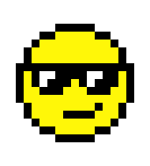

Criando **minha** _página_ ~~principal~~.

# Quem sou eu

Matheus Augusto S. Severiano.

Aluno do curso técnico integrado ao ensino médio em Programação de Jogos Digitais.

Essa página foi criada como requisito avaliativo na disciplina de Motores de Jogos II ministrada pelo Professor: Ms. Marcelo de Barros Barbosa.

Contato:  
 Email Pessoal: mathaugustt@icloud.com  
 Email Acadêmico: matheus.soares@academico.ifrn.edu.br  
 [Currículo Lattes](http://lattes.cnpq.br/8754198449610994)  
 
# Portfólio

## Games:

**NORDESTE ADVENTURE**  

~~Primeiro Joguinho, né galera?~~  

Jogo Desenvolvido com a colega Bruna Noronha como requisito avaliativo do 1º Bimestre para a disciplina de Oficina de Jogos Digitais ministrada pelo Professor: Ms. Marcelo Barbosa.  
[Site da Bruna](brunitxia.github.io)

* * *

**RUN JULIANA RUN**  

**ESSE FOI UM SUCESSO! <3**  

Jogo Desenvolvido com o colega Lucas Revorêdo como requisito avaliativo do 2º Bimestre para a disciplina de Oficina de Jogos Digitais ministrada pelo Professor: Ms. Marcelo Barbosa.  
[Site do Lucas](revoredoo.github.io)

* * *

**DEFENSE OF THE ORGANISM**  

_Tentando, ainda em fase de testes!_  

Jogo Desenvolvido para servir como bases para o Relatório de Projeto Integrador que também terá a orientação do Professor: Ms. Marcelo Barbosa.

* * *

[JOGO1](link.github.io)

## Artes
* Criam listas não ordenadas 
1. criam listas ordenadas  

## Projetos/Outros
*Clube da Leitura

* * *

** negrito  
_ itálico  
~~ riscado  

3* linha horizontal(barra)
#s uma ou mais hashtags criam capítulos ou subcapítulos
[TEXTO QUE VAI APARECER](link)

* * *
